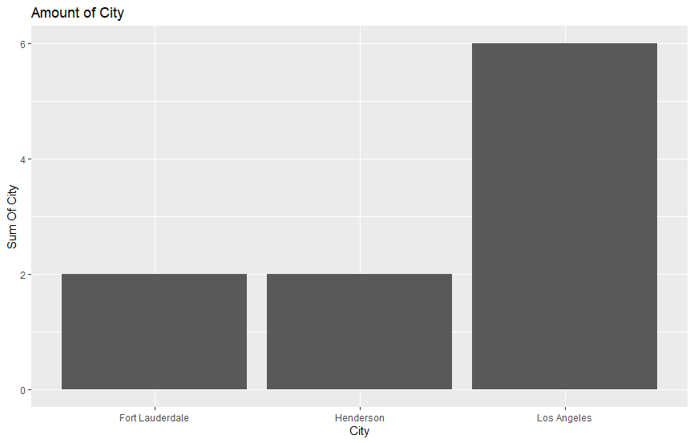
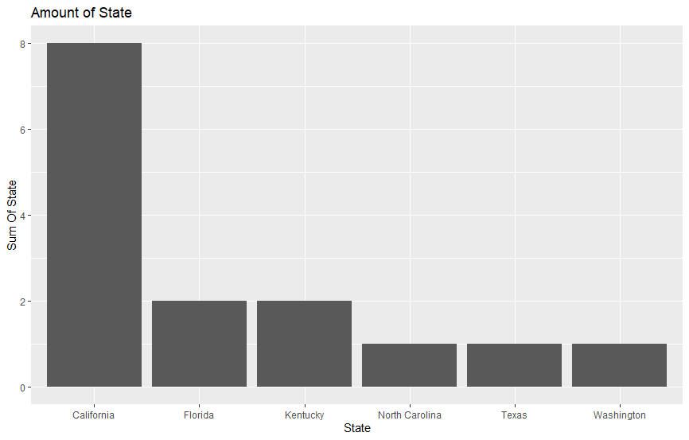

# R-Assignment 4

*Created by Name-Surname (ID: 63130500028)*

Choose Dataset:
1. Top 270 Computer Science / Programing Books (Data from Thomas Konstantin, [Kaggle](https://www.kaggle.com/thomaskonstantin/top-270-rated-computer-science-programing-books)) >> [Using CSV](https://raw.githubusercontent.com/safesit23/INT214-Statistics/main/datasets/prog_book.csv)

2. Superstore Sales Dataset (Data from Rohit Sahoo,[Kaggle](https://www.kaggle.com/rohitsahoo/sales-forecasting)) >> [Using CSV](https://raw.githubusercontent.com/safesit23/INT214-Statistics/main/datasets/superstore_sales.csv)


### Outlines
1. Explore the dataset
2. Learning function from Tidyverse
3. Transform data with dplyr and finding insight the data
4. Visualization with GGplot2

## Part 1: Explore the dataset

```
# Library
library(dplyr)
library(stringr)
library(tidyr)
library(assertive)
library(readr)
library(ggplot2)

# Dataset
dataset <- read_csv("https://raw.githubusercontent.com/safesit23/INT214-Statistics/main/datasets/superstore_sales.csv")
```
In this dataset has
```
Rows: 9800 Columns: 18                                                                                                 
-- Column specification -------------------------------------------------------------------------------------------------
Delimiter: ","
chr (15): Order ID, Order Date, Ship Date, Ship Mode, Customer ID, Customer Name, Segment, Country, City, State, Regi...
dbl  (3): Row ID, Postal Code, Sales
```

## Part 2: Learning function from Tidyverse

- Function select() from package [dplyr](https://dplyr.tidyverse.org/articles/dplyr.html#select-columns-with-select)). It using for select columns

```
starwars %>% select(name,height)
```


## Part 3: Transform data with dplyr and finding insight the data

1.หาข้อมูลของ order id 10คนแรก

```
dataset$`Order ID` %>% head(10)
```

Result:

```
[1] "CA-2017-152156" "CA-2017-152156" "CA-2017-138688" "US-2016-108966"
[5] "US-2016-108966" "CA-2015-115812" "CA-2015-115812" "CA-2015-115812"
[9] "CA-2015-115812" "CA-2015-115812"
```

แสดงผลorder id ของ10คนแรกใน dataset


2.เรียงลำดับข้อมูลของ Column Sales จากน้อยไปหามาก

```
dataset %>% arrange(Sales)
```

  Result:
```
# A tibble: 9,800 x 18
   `Row ID` `Order ID`     `Order Date` `Ship Date` `Ship Mode` `Customer ID` `Customer Name` Segment Country City  State `Postal Code`
      <dbl> <chr>          <chr>        <chr>       <chr>       <chr>         <chr>           <chr>   <chr>   <chr> <chr>         <dbl>
 1     4102 US-2018-102288 19/06/2018   23/06/2018  Standard C~ ZC-21910      Zuschuss Carro~ Consum~ United~ Hous~ Texas         77095
 2     9293 CA-2018-124114 02/03/2018   02/03/2018  Same Day    RS-19765      Roland Schwarz  Corpor~ United~ Waco  Texas         76706
 3     8659 CA-2017-168361 21/06/2017   25/06/2017  Standard C~ KB-16600      Ken Brennan     Corpor~ United~ Chic~ Illi~         60623
 4     4712 CA-2015-112403 31/03/2015   31/03/2015  Same Day    JO-15280      Jas O'Carroll   Consum~ United~ Phil~ Penn~         19120
 5     2107 US-2015-152723 26/09/2015   26/09/2015  Same Day    HG-14965      Henry Goldwyn   Corpor~ United~ Mesq~ Texas         75150
 6     7549 CA-2015-103492 10/10/2015   15/10/2015  Standard C~ CM-12715      Craig Molinari  Corpor~ United~ Hunt~ Texas         77340
 7     8034 CA-2016-119690 25/06/2016   28/06/2016  First Class MV-17485      Mark Van Huff   Consum~ United~ Hous~ Texas         77041
 8     2762 CA-2018-126536 12/10/2018   14/10/2018  First Class NK-18490      Neil Knudson    Home O~ United~ San ~ Cali~         94110
 9     8025 CA-2015-129189 21/07/2015   25/07/2015  Standard C~ HM-14860      Harry Marie     Corpor~ United~ Dall~ Texas         75217
10      977 US-2018-100209 09/07/2018   15/07/2018  Standard C~ TD-20995      Tamara Dahlen   Consum~ United~ Port~ Oreg~         97206
# ... with 9,790 more rows, and 6 more variables: Region <chr>, Product ID <chr>, Category <chr>, Sub-Category <chr>,
#   Product Name <chr>, Sales <dbl>
```

ราคาใน column Sales จะเรียงตัวเลขขากน้อยไปมาก

3.ค่าของ sales สูงสุดกับต่าสุดห่างกันเท่าไร
```
MAXsales <- dataset$Sales %>% max()
MINsales <- dataset$Sales %>% min()
MAXsales - MINsales
```
Result:
```
[1] 22638.04
```

ห่างกัน 22638.04


4.ค่าเฉลี่ยของ Sales มีค่าเท่าไหร่

```
data.frame(dataset$Sales %>% mean())
```

Result:

```
 dataset.Sales.....mean..
1                 230.7691
```
มีค่า 230.7691

5.ดู 50 จำนวนแรกของของข้อมูล Customer Name
```
dataset$`Customer Name` %>% head(50)
```

Result:
```
[1] "Claire Gute"        "Claire Gute"        "Darrin Van Huff"    "Sean O'Donnell"     "Sean O'Donnell"     "Brosina Hoffman"    "Brosina Hoffman"    "Brosina Hoffman"   
 [9] "Brosina Hoffman"    "Brosina Hoffman"    "Brosina Hoffman"    "Brosina Hoffman"    "Andrew Allen"       "Irene Maddox"       "Harold Pawlan"      "Harold Pawlan"     
[17] "Pete Kriz"          "Alejandro Grove"    "Zuschuss Donatelli" "Zuschuss Donatelli" "Zuschuss Donatelli" "Ken Black"          "Ken Black"          "Sandra Flanagan"   
[25] "Emily Burns"        "Eric Hoffmann"      "Eric Hoffmann"      "Tracy Blumstein"    "Tracy Blumstein"    "Tracy Blumstein"    "Tracy Blumstein"    "Tracy Blumstein"   
[33] "Tracy Blumstein"    "Tracy Blumstein"    "Matt Abelman"       "Gene Hale"          "Gene Hale"          "Steve Nguyen"       "Steve Nguyen"       "Steve Nguyen"      
[41] "Steve Nguyen"       "Linda Cazamias"     "Ruben Ausman"       "Erin Smith"         "Odella Nelson"      "Odella Nelson"      "Patrick O'Donnell"  "Lena Hernandez"    
[49] "Lena Hernandez"     "Darren Powers"     
```
โชว์ข้อมูล50ตัวแรกในCustomer Name

6.ราคาสูงสุดของ Sales

```
dataset$Sales %>% min()
```

Result:

```
[1] 0.444
```
ราคาสูงสุด คือ 0.444


## Part 4: Visualization with GGplot2
### 1.) กราฟแสดง Amount of City ของ 10 คนแรก
```
cc <- dataset %>% head(10) %>% ggplot(aes(x=City))+geom_bar()+ggtitle("Amount of City")+ylab("Sum Of City")
cc
```
Result:



### 2.) กราฟแสดง State 20 คนแรก
```
SHSE <- dataset %>% head(15) %>% ggplot(aes(x=State))+geom_bar()+ggtitle("Amount of State")+ylab("Sum Of State")
SHSE
```
Result:

