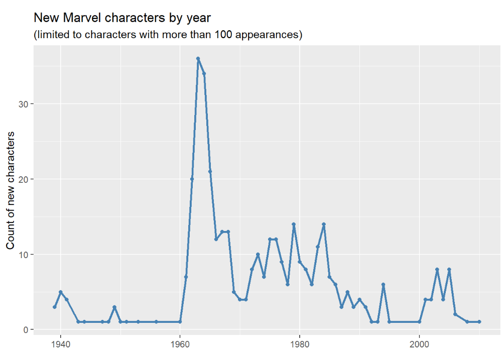
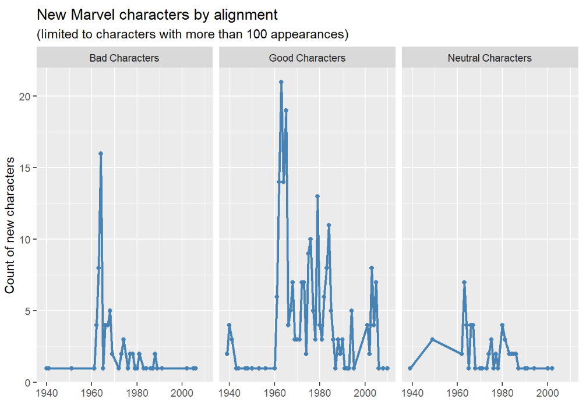
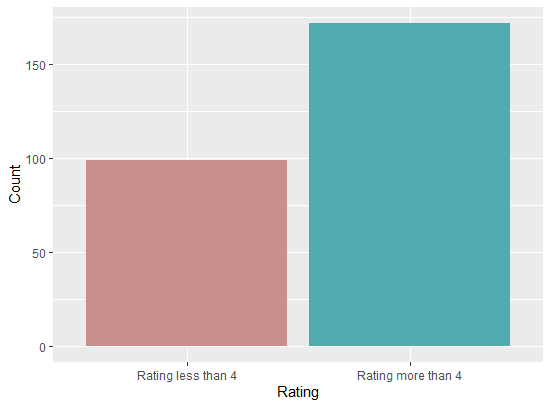

# R-Assignment 4

**Created by นัฐวัฒ รอดสมบุญ (ID: 63130500069)**

Dataset:
Top 270 Computer Science / Programing Books (Data from Thomas Konstantin, [Kaggle](https://www.kaggle.com/thomaskonstantin/top-270-rated-computer-science-programing-books)) >> [Using CSV](https://raw.githubusercontent.com/safesit23/INT214-Statistics/main/datasets/prog_book.csv)


### Outlines
1. Explore the dataset
2. Learning other function
3. Finding insight the data
4. Visualization with GGplot2

## Part 1: Explore the dataset
## Import Library

```{R}
# Library
library(ggplot2)
library(dplyr)
library(readr)
library(hrbrthemes)
```
## Import Dataset
```{R}
prog_book <- read_csv("https://raw.githubusercontent.com/safesit23/INT214-Statistics/main/datasets/prog_book.csv")
```
ดูรายละเอียดต่างๆของ dataset โดยใช้คำสั่ง glimpse
```{R}
glimpse(prog_book)
```
result
```{R}
Rows: 271
Columns: 7
$ Rating          <dbl> 4.17, 4.01, 3.33, 3.97, 4.06, 3.84, 4.09, 4.15, 3.87, 4.62, 4.03, 3.78, 3.73,…
$ Reviews         <dbl> 3829, 1406, 0, 1658, 1325, 117, 5938, 1817, 2093, 0, 160, 481, 33, 1255, 593,…
$ Book_title      <chr> "The Elements of Style", "The Information: A History, a Theory, a Flood", "Re…
$ Description     <chr> "This style manual offers practical advice on improving writing skills. Throu…
$ Number_Of_Pages <dbl> 105, 527, 50, 393, 305, 288, 256, 368, 259, 128, 352, 352, 200, 328, 240, 288…
$ Type            <chr> "Hardcover", "Hardcover", "Kindle Edition", "Hardcover", "Kindle Edition", "P…
$ Price           <dbl> 9.323529, 11.000000, 11.267647, 12.873529, 13.164706, 14.188235, 14.232353, 1…
```
summay dataset
```{R}
summary(prog_book)
```
Result :
```{R}
  Rating         Reviews        Book_title        Description        Number_Of_Pages 
 Min.   :3.000   Min.   :   0.0   Length:271         Length:271         Min.   :  50.0  
 1st Qu.:3.915   1st Qu.:   5.5   Class :character   Class :character   1st Qu.: 289.0  
 Median :4.100   Median :  35.0   Mode  :character   Mode  :character   Median : 384.0  
 Mean   :4.067   Mean   : 185.6                                         Mean   : 475.1  
 3rd Qu.:4.250   3rd Qu.: 116.5                                         3rd Qu.: 572.5  
 Max.   :5.000   Max.   :5938.0                                         Max.   :3168.0  
     Type               Price        
 Length:271         Min.   :  9.324  
 Class :character   1st Qu.: 30.751  
 Mode  :character   Median : 46.318  
                    Mean   : 54.542  
                    3rd Qu.: 67.854  
                    Max.   :235.650  
```

<p> dataset นี้เกี่ยวกับรายชื่อหนังสือ 270 เล่มในสาขาวิทยาการคอมพิวเตอร์และหัวข้อที่เกี่ยวข้องกับการเขียนโปรแกรม
รายชื่อหนังสือถูกสร้างขึ้นโดยใช้เว็บไซต์ยอดนิยมหลายแห่งซึ่งให้ข้อมูลเกี่ยวกับการจัดอันดับหนังสือ และหนังสือทั้งหมดในเว็บไซต์เหล่านั้นซึ่งได้รับความนิยมสูงสุด 270 เล่ม
ภายในชุดข้อมูลตนี้ คุณจะพบข้อมูลทั่วไปเกี่ยวกับหนังสือ รวมถึงจำนวนหน้าในหนังสือ ประเภทหนังสือ คำอธิบายหนังสือ และราคาหนังสือ </p>
<p> dataset นี้ประกอบไปด้วย 270 observations และ 7 variables ประกอบไปด้วย </p>
  
* Book_title  : ชื่อหนังสือ หัวข้อเรื่องของหนังสือ 
* Description : คำอธิบายเกี่ยวกับหนังสือ รายละเอียดหนังสือ 
* Type  : ประเภทของหนังสือ เช่น ปกแข็งปกอ่อน
* Rating  : คะแนนการประเมินของหนังสือ
* Reviews : จำนวนการรีวิวของผู้อ่าน
* Number_Of_Pages : จำนวนหน้าหนังสือ
* Price : ราคาของหนังสือ


## Part 2: Learning other function 

- Function `slice_max()` from package [dplyr](https://dplyr.tidyverse.org/articles/base.html?q=sli#slice-choose-rows-by-position)). ซึ่งฟังก์ชันนี้ใช้สำหรับตัดเอาค่ามากที่สุดตามที่ต้องการมา โดยสามารถตัดมากี่ข้อมูลก็ได้ตามที่เราต้องการ

```
mtcars %>% slice_max(mpg, n = 5)

#>                 mpg cyl disp  hp drat    wt  qsec vs am gear carb
#> Toyota Corolla 33.9   4 71.1  65 4.22 1.835 19.90  1  1    4    1
#> Fiat 128       32.4   4 78.7  66 4.08 2.200 19.47  1  1    4    1
#> Honda Civic    30.4   4 75.7  52 4.93 1.615 18.52  1  1    4    2
#> Lotus Europa   30.4   4 95.1 113 3.77 1.513 16.90  1  1    5    2
#> Fiat X1-9      27.3   4 79.0  66 4.08 1.935 18.90  1  1    4    1
```
- Function `slice_max()` from package [ggplot2](https://ggplot2.tidyverse.org/)) เป็นฟังก์ชันที่เราใช้สำหรับแบ่งกราฟออกเป็นหลายๆกราฟ ตามชนิดของข้อมูลที่เรามีได้ ตัวอย่าง
<p> เราใช้ dataset Marvel characters แล้วลองมาทำกราฟแสดงข้อมูลระหว่างปีกับจำนวนฮีโร่ที่เกิดมา </p>

```
ggplot(data = marvel_count, aes(year, n)) +
  geom_line(color = "steelblue",size = 1) +
  geom_point(color="steelblue") + 
  labs(title = "New Marvel characters by year",
       subtitle = "(limited to characters with more than 100 appearances)",
       y = "Count of new characters", x = "")
```
Result:


### ใน dataset นี้มีข้อมูลของตัวละครที่ "ดี" และ "ไม่ดี" หากเราอยากแยกเป็นสองกราฟมาเปรียบเทียบกัน เราสามารถใช้  facet_wrap() ได้

```
  ggplot(data = marvel_count, aes(year, n)) +
  geom_line(color = "steelblue", size = 1) +
  geom_point(color="steelblue") + 
  labs(title = "New Marvel characters by alignment",
       subtitle = "(limited to characters with more than 100 appearances)",
       y = "Count of new characters", x = "") + 
  facet_wrap(~ align)
  
```

Result:


<p> จะเห็นว่ากราฟของเราจะแบ่งเป็นสามอันตามจำนวนข้อมูลของ align ใน dataset  


## Part 3: finding insight the data

### 1).จำนวนการรีวิวคร่าวๆ ของหนังสือที่มีเรทติ้งมากกว่าค่าเฉลี่ยของเรตติ้ง

```
Q1 <- Book %>% filter(Rating > (avgRating = mean(Rating))) 
mean(Q1$Reviews)
```

Result:

```
> mean(Q1$Reviews)
[1] 210.7687
```
แสดงว่าโดยทั่วไปแล้ว หนังสือที่มีเรตติ้งมากกว่าค่าเฉลี่ย มีการรีวิวประมาณ 210 รีวิว

### 2).จำนวนหน้าหนังสือของหนังสือที่แพงที่สุด


```
Q2 <- Book %>% filter(Price == max(Book$Price)) %>% select(Number_Of_Pages)

```

Result:

```
 Number_Of_Pages
            <dbl>
1             789

```
แสดงว่าหนังสือที่แพงที่สุดจาก 270 เล่ม มีจำนวนหน้าทั้งหมด 789 หน้า

### 3). หนังสือที่มีการรีวิวมากสุด สามเล่มแรก ชื่ออะไรบ้าง

```
Q3 <- Book %>% slice_max(Reviews , n=3) %>% select(Book_title)

```

Result:

```
  Book_title                                                                  
  <chr>                                                                       
1 Start with Why: How Great Leaders Inspire Everyone to Take Action           
2 The Elements of Style                                                       
3 The Phoenix Project: A Novel About IT, DevOps, and Helping Your Business Win

```
หนังสือสามเล่มที่มีการรีวิวมากที่สุดคือ  Start with Why: How Great Leaders Inspire Everyone to Take Action และ  The Elements of Style  และ The Phoenix Project: A Novel About IT, DevOps, and Helping Your Business Win

### 4). จำนวนหน้าของหนังสือปกแข็งที่น้อยที่สุด

```
Q4 <- Book %>% filter(Type == "Hardcover")
min(Q4$Number_Of_Pages)
```

Result:

```
 > min(Q4$Number_Of_Pages)
[1] 105

```
หนังสือปกแข็งเล่มที่มีหน้าน้อยที่สุด มีหน้าจำนวน 105 หน้าเท่านั้น
### 5). หนังสือเล่มไหนบ้างที่ยังไม่มีการรีวิว


```
Q5 <- Book  %>% filter(Reviews == 0)%>% select(Book_title)

```

Result:

```
  Book_title                                                                     
   <chr>                                                                          
 1 Responsive Web Design Overview For Beginners                                   
 2 ZX Spectrum Games Code Club: Twenty fun games to code and learn                
 3 Game Programming Golden Rules                                                  
 4 Beginners Guide On PHP Programming: Quick And Easy Guide To Learn PHP With My-~
 5 Python Programming Books Set: Python Programming for Beginners & Complete Guid~
 6 Your First App: Node.js                                                        
 7 Python Programming For Beginners: Quick And Easy Guide For Python Programmers  
 8 Building an FPS Game with Unity                                                
 9 Advanced Game Programming: A Gamedev.Net Collection                            
10 Basic Proof Theory                                                             
# ... with 12 more rows

```
### 6). หนังสือที่มีการรีวิวมากที่สุดมีเรตติ้งเท่าไหร่


```
Q6 <- Book %>% filter(Reviews == max(Reviews)) %>% select(Rating)

```

Result:

```
  Rating
   <dbl>
1   4.09

```
หนังสือที่มีการรีวิวมากที่สุดนั้นมีเรตติ้งอยู่ที่ 4.09 คะแนน

## Part 4: Visualization with GGplot2
### 1.) กราฟแสดงความสัมพันธ์ระหว่างราคากับจำนวนหน้าหนังสือของหนังสือแต่ละประเภท

```
Book %>%  ggplot(aes(x=Number_Of_Pages,y=Price ,color=Type))+geom_point() +
  theme_ipsum() 
  +  facet_wrap(~Type)
```
Result:


เป็นกราฟที่แสดงความสัมพันธ์ระหว่าง ราคาของหนังสือ กับ จำนวนหน้าของหนังสือว่ามีความสัมพันธ์กันไปในทางไหน โดยแยกแต่ละประเภทไว้
เราจะเห็นได้ว่า ยิ่งจำนวนหน้าเยอะ ราคาของหนังสือก็จะแพงขึ้นด้วย แต่ก็เป็นแค่ส่วนนึงของเหตุผลเท่านั้น ยังมีปัจจัยอื่นๆอยู่อีก

### 2.) กราฟจำนวนหนังสือระหว่างหนังสือที่มีเรตติ้งน้อยกว่า4 กับหนังสือที่มีเรตติ้งมากกว่า 4 

```
BookOne <- Book %>% filter(Rating <= 4)
Num <- count(BookOne)

BookTwo <- Book %>% filter(Rating > 4)
NumTwo <- count(BookTwo)


ggplot(data2, aes(x=Rating, y=Count , fill=Rating)) + 
  geom_bar(stat = "identity")  +
  scale_fill_hue(c = 40) +
  theme(legend.position="none")
```
Result:



เป็นกราฟที่แสดงความสัมพันธ์ระหว่างจำนวนหนังสือกับเรตติ้งของหนังสือ โดยจะเห็นได้ว่า จำนวนหนังสือที่มีเรตติ้งมากกว่า 4 นั้นมีมากกว่า หนังสือที่มีเรตติ้งน้อยกว่า 4
